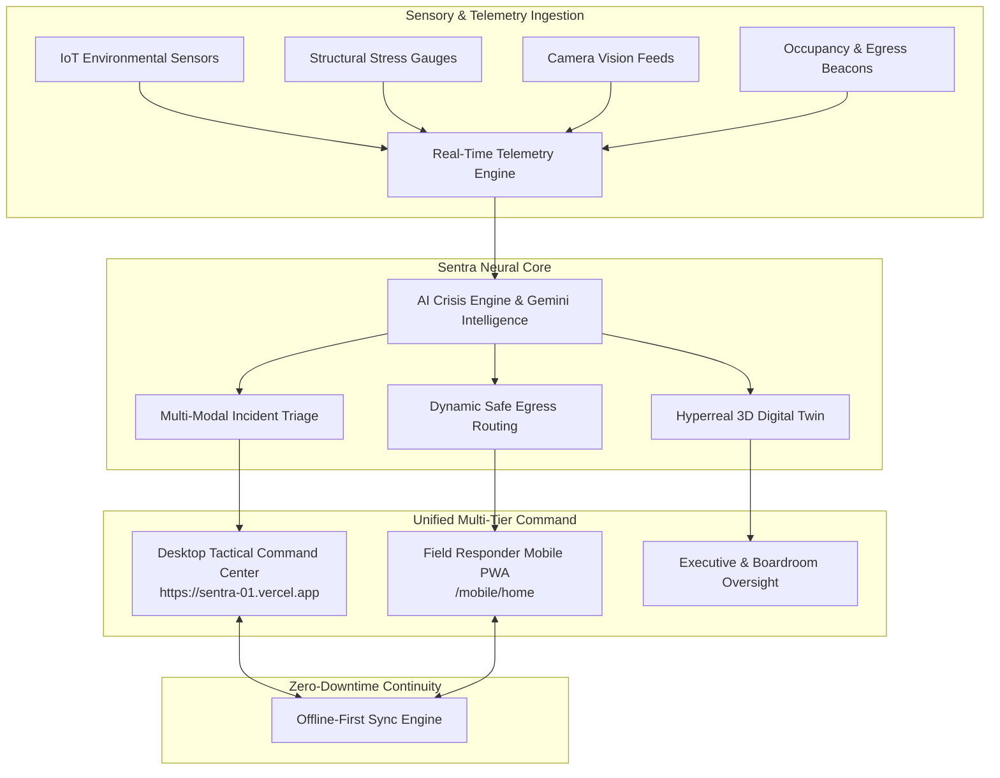

# ⚡ SENTRA — AI Crisis Intelligence & Continuous Tactical Operations OS

<div align="center">

[](https://sentra-01.vercel.app/)
[](https://nextjs.org/)
[](https://www.typescriptlang.org/)
[](https://tailwindcss.com/)
[](LICENSE)

### 🛰️ The Autonomous Neural Backbone for Mission-Critical Facilities & Emergency Operations

**[🖥️ Launch Desktop Command Center](https://sentra-01.vercel.app/)** &nbsp;•&nbsp; **[📱 Open Integrated Field Mobile](https://sentra-01.vercel.app/mobile)** &nbsp;•&nbsp; **[📲 Standalone Field App](https://sentra-xi.vercel.app/)**

</div>

---

## 🌐 Overview & Operational Mission

**Sentra** is an enterprise-grade **AI Crisis Intelligence Operating System** engineered for stadiums, high-density campuses, hospitals, airports, critical infrastructure, and tactical emergency centers. 

When disaster strikes—be it structural failure, fire outbreaks, seismic hazards, or multi-vector cyber-physical threats—traditional command systems buckle under fragmented communications, lagging manual updates, and siloed decision hierarchies. 

Sentra changes this paradigm by synthesizing live telemetry, digital twin simulations, multi-modal sensor fusion, and autonomous AI triage into an **unbreakable, continuous operating picture**.



---

## ⚡ Instant Live Access & Demo Credentials

Sentra features **zero-friction instant demonstration access** with pre-configured role profiles. In production or cloud demo modes where external OAuth configurations are isolated, you can enter immediately using the **1-Click Instant Access** on the login screen or with the credentials below:

| Role Profile | Direct Email | Password | Primary Clearance & Capabilities |
| :--- | :--- | :--- | :--- |
| **🎖️ Commander** | `commander@sentra.demo` | `SentraDemo!2026` | Full tactical authority, lockdown controls, live evacuation triggers |
| **🛡️ System Admin** | `admin@sentra.demo` | `SentraDemo!2026` | Enterprise management, global cloud tenant routing, user RBAC |
| **🦺 Safety Officer** | `officer@sentra.demo` | `SentraDemo!2026` | Real-time sensor telemetry, hazard containment, zone sweeps |
| **📋 Compliance Auditor** | `auditor@sentra.demo` | `SentraDemo!2026` | Immutable audit trail logs, SOC forensics, legal record verification |
| **📈 Operations Analyst** | `analyst@sentra.demo` | `SentraDemo!2026` | Post-incident analytics, predictive risk simulations, ML telemetry |

> **Quick Access Shortcut:** On the [Sentra Access Portal](https://sentra-01.vercel.app/login), click any role pill under **Demo Role Quick Access** to instantly populate credentials and launch into the command environment.

---

## 🚀 Key Architectural Pillars

### 1. 🎛️ Unified Desktop & Mobile Command Center
Sentra unifies high-density desktop monitoring and field responder mobility into a singular coherent architecture:
- **Desktop Command (`/app`)**: Multi-monitor ready tactical interface featuring live situation streams, active incident queue, AI confidence matrices, threat assessment meters, and one-click crisis posture adjustments.
- **Integrated Field Ops (`/mobile`)**: Native-feeling mobile PWA accessible directly from the desktop command bar (`📱 Mobile Ops`) or standalone on mobile devices. Features turn-by-turn hazard-avoiding egress navigation, instant SOS signaling, responder team status, and offline queue synchronization.

### 2. 🧠 Autonomous AI Crisis Engine & Multi-Agent Council
- **Predictive Escalation Modeling**: Calculates structural failure, smoke dispersion, and crowd bottleneck probabilities before casualties occur.
- **Incident Prioritization Matrix**: Categorizes multiple simultaneous incidents by criticality, blast radius, and active human density.
- **Automated Advisory Generation**: Formulates natural-language containment directives reviewed by the AI Advisory Council for human-in-the-loop validation.

### 3. 🗺️ Hyperreal Digital Twin & Facility Simulation
- **Structural Telemetry**: Real-time visualization of floor plans, zones, emergency exits, and elevator statuses.
- **Dynamic Heatmaps**: Atmospheric gas levels, thermal anomalies, corridor congestion, and power grid stability mapped onto interactive layers.
- **Replay & Scenario Sandbox**: Review past emergency events or stress-test contingency plans with simulated fire, power outage, or breach events.

### 4. 📴 Offline-First Resilience & Air-Gapped Continuity
- **Zero-Dependency Fallback**: When network connections are severed during a catastrophe, client-side persistence (Zustand + local storage caches) preserves last-known safe evacuation routes and active personnel tasks.
- **Auto-Sync Queue**: Field actions taken offline (SOS alerts, task completions, responder check-ins) are safely queued and flushed automatically the instant telemetry reconnects.

### 5. 🎨 Cyber-Tactical Visual Palette & Materials
- **Obsidian Midnight Canvas (`#030712`)**: Deep cosmic dark background optimized for high-stress operational environments.
- **Translucent Obsidian Glass (`rgba(8, 14, 28, 0.88)`)**: Precision-frosted backdrops with luminous electric cyan (`#22d3ee`) and sapphire blue border highlights.
- **Aesthetic Isolation**: Enhanced internal command workspaces without altering the signature public landing page (`/`) or login screen (`/login`).

---

## 📁 Repository & System Structure

```
sentra/
├── app/                           # Next.js 16 App Router
│   ├── (auth)/login/              # Resilient Authentication Gateway
│   ├── app/                       # Protected Tactical Command Center
│   │   ├── ai-council/            # Autonomous Intelligence & War Room
│   │   ├── analytics/             # Telemetry & Operating Metrics
│   │   ├── map/                   # Spatial Sensor & Infrastructure Map
│   │   └── settings/              # System & Session Preferences
│   ├── mobile/                    # Unified Mobile Field Responder App
│   │   ├── home/                  # Responder Dashboard & Status Posture
│   │   ├── route/                 # Turn-by-Turn Dynamic Egress Navigation
│   │   ├── alert/                 # Live Emergency Broadcast & Audio Guidance
│   │   ├── sos/                   # 1-Tap Distress Signaling & GPS Beacon
│   │   ├── staff/                 # Field Personnel Task Queue
│   │   └── offline/               # Cached Local Continuity Engine
│   ├── twin/                      # Facility & Campus Digital Twin System
│   ├── incidents/                 # Incident Command & Triage Stream
│   └── layout.tsx                 # Master Shell & Telemetry Hydration
├── components/
│   ├── app/                       # Desktop Command Center Shell & Sidebar
│   ├── mobile/                    # Mobile PWA Components (BottomNav, SOS, Map)
│   ├── security/                  # RBAC Guards, Login Form, Session Management
│   └── ui/                        # High-End Design System & Cyber Accents
├── lib/
│   ├── auth/                      # Resilient Dual-Mode Authentication Engine
│   ├── mobile/                    # Mobile State, Task Engines & Simulation Data
│   ├── rbac/                      # Role-Based Access Control Definitions
│   └── realtime/                  # Real-Time Sensor & Telemetry Data Streams
├── store/                         # Zustand Global State Machines
│   ├── auth-store.ts              # Session & Permission State
│   └── useMobileStore.ts          # Mobile Offline Persistence State
├── styles/
│   ├── globals.css                # Global Design Tokens & Cyber Styling
│   └── tokens.css                 # Master Visual Foundation 2.0 Tokens
└── apps/mobile/                   # Modular Standalone Mobile Companion Package
```

---

## 🛠️ Quickstart & Local Setup

### Prerequisites
- **Node.js**: `v20.x` or higher
- **npm**: `v10.x` or higher
- **Git**

### Installation

1. **Clone the repository:**
   ```bash
   git clone https://github.com/Balashanmugam30/sentra.git
   cd sentra
   ```

2. **Install all dependencies across workspaces:**
   ```bash
   npm install
   ```

3. **Configure Environment Variables:**
   Create `.env.local` in the project root:
   ```env
   # Application Configuration
   NEXT_PUBLIC_APP_NAME="Sentra"
   NEXT_PUBLIC_APP_ENV="development"
   NEXT_PUBLIC_SITE_URL="http://localhost:3000"

   # Firebase Auth Configuration (Optional in Demo Mode)
   NEXT_PUBLIC_FIREBASE_API_KEY=""
   NEXT_PUBLIC_FIREBASE_AUTH_DOMAIN=""
   NEXT_PUBLIC_FIREBASE_PROJECT_ID=""
   NEXT_PUBLIC_FIREBASE_STORAGE_BUCKET=""
   NEXT_PUBLIC_FIREBASE_MESSAGING_SENDER_ID=""
   NEXT_PUBLIC_FIREBASE_APP_ID=""
   ```

4. **Verify TypeScript across all workspaces:**
   ```bash
   npm run typecheck
   ```

5. **Start the local development server:**
   ```bash
   npm run dev
   ```
   Open [http://localhost:3000](http://localhost:3000) to view the Command Center.

6. **Create an optimized production build:**
   ```bash
   npm run build
   ```

---

## 🚀 Deployment

| Target | Deployment URL | Description |
| :--- | :--- | :--- |
| **Desktop & Unified Mobile** | [sentra-01.vercel.app](https://sentra-01.vercel.app/) | Primary Vercel deployment with full command center and `/mobile` routes |
| **Field Mobile Companion** | [sentra-xi.vercel.app](https://sentra-xi.vercel.app/) | Dedicated field mobile PWA deployment |

---

## 🛡️ Security, Privacy & Compliance

- **End-to-End Session Guard**: Automatic inactive device lockouts, secure refresh tokens, and multi-tenant domain isolation.
- **Zero-Trust Role Enforcement**: Granular cryptographic permission checks on every route, action, and telemetry pipe.
- **Audit-Grade Traceability**: Tamper-evident activity logs adhering to SOC2 Type II, ISO 27001, and NIST emergency management standards.

---

<div align="center">

**Built with precision for uncompromised operational continuity.**  
© 2026 Sentra Autonomous Systems. All rights reserved.

</div>
