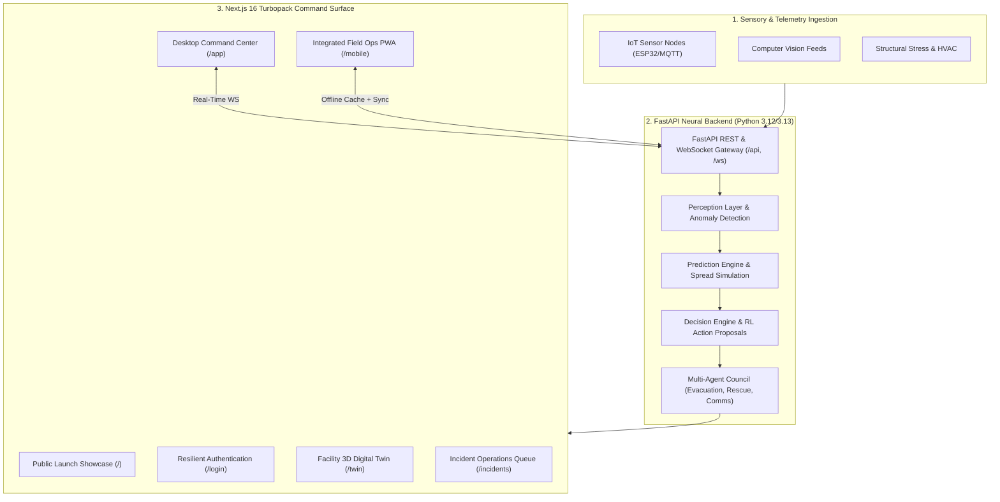

# 🏛️ Sentra System Architecture & Technical Specification

> **System Identity:** Sentra — AI Crisis Intelligence & Continuous Tactical Operations OS  
> **Core Operating Loop:** Observe → Understand → Predict → Decide → Execute → Learn → Scale  
> **Repository:** `https://github.com/Balashanmugam30/sentra`  
> **Primary Deployment:** `https://sentra-01.vercel.app`

---

## 1. High-Level Architecture

Sentra is engineered as a unified, resilient crisis intelligence platform synthesizing high-throughput sensory feeds, digital twin simulations, autonomous multi-agent reasoning, and field responder tactical coordination.

---

## 2. Co-located Fullstack Topology

The repository houses both the high-performance Python FastAPI service and the Next.js 16 frontend within a unified structure:

- **Next.js 16 App Router (React 19)**: Handles all presentation, command consoles, field operations, and client-side simulation rendering.
- **FastAPI Backend (`app/main.py`)**: Provides high-performance REST APIs, event streaming over WebSockets, agent orchestration, and algorithmic computation.
- **Edge Proxy (`proxy.ts`)**: Next.js middleware acting as an edge reverse-proxy rewriting `/api/*` and `/soc/*` requests directly to backend services while enforcing session cookies.

---

## 3. Canonical Routing & URL Architecture

All route families have been consolidated to enforce clear single sources of truth:

| URL Pattern | Purpose | Canonical Target | Redirection / Behavior |
| :--- | :--- | :--- | :--- |
| `/` | Public Launch Showcase | Self | Canonical landing experience (preserved visual identity) |
| `/login` | Resilient Authentication | Self | Preserved multi-step demo & credentials gate |
| `/app` | Authenticated Desktop OS | Self | Canonical command center and workspace hub |
| `/dashboard` | Legacy desktop alias | `/app` | HTTP 308 Permanent Redirect + Middleware rewrite |
| `/app/dashboard` | Legacy nested alias | `/app` | HTTP 308 Permanent Redirect + Middleware rewrite |
| `/landing` | Legacy showcase alias | `/` | HTTP 308 Permanent Redirect + Middleware rewrite |
| `/mobile` | Field Responder Root | `/mobile/home` | Launches unified mobile shell and bottom navigation |
| `/mobile/*` | Field Mobile Routes | Self | PWA-scoped routes (`alert`, `route`, `sos`, `staff`, `offline`) |

---

## 4. Authentication, Session & RBAC

Sentra supports hybrid authentication modes:
1. **Firebase Authentication**: Production cloud identity provider.
2. **Local Demo Auth Fallback**: Air-gapped fallback with instant 1-click profiles (`admin`, `commander`, `officer`, `auditor`, `analyst`).
3. **Session Guards**:
   - `RouteGuard`: React client-side permission and authentication barrier.
   - `proxy.ts`: Edge-level cookie inspection verifying `sentra_session`, `sentra_access_token`, or `sentra_refresh_token`.
   - `useAuthStore` + `useUserStore`: Synchronized reactive stores with local persistence.

---

## 5. Future Capability Seams & Type Contracts

To prepare for autonomous multi-agent reasoning, perception, and digital twin simulation phases without breaking current logic, explicit type contracts are defined in [`types/incident-intelligence.ts`](file:///types/incident-intelligence.ts):

- `IncidentEvidence`: Multi-modal evidence ingest (sensor telemetry, thermal signatures, camera frames).
- `AIConfidenceAssessment`: Multi-dimensional confidence scoring for autonomous recommendations.
- `ProposedAction`: Structured tactical recommendations with life-saving impact estimation and human approval chains.
- `TimelineEvent`: Immutable, auditable forensic sequence of incident progression.
- `SimulationScenario`: Environmental, structural, and occupancy parameters for facility digital twin stress-testing.
