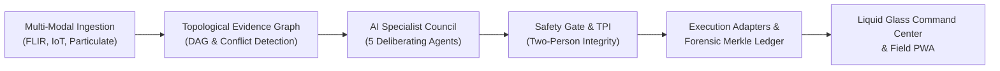

# SENTRA PRODUCT OVERVIEW
### AI Crisis Intelligence & Continuous Tactical Operations OS

---

## 1. Executive Summary

**Sentra** is an intelligent tactical operating system designed for modern Emergency Operations Centers (EOCs), industrial campus safety directors, and municipal crisis managers. 

Traditional incident response relies on fragmented telemetry, manual radio triage, and static paper binders. In high-consequence crisis scenarios—such as industrial conflagrations, hazardous chemical releases, structural collapses, and severe crowd emergencies—seconds matter. Sentra unifies multi-modal sensor streams, constructs topological evidence graphs, coordinates multi-agent AI deliberation, and enforces mathematical safety gates before tactical actions can be dispatched.

---

## 2. Target Users & Operational Personas

1. **Incident Commander (IC):** Strategic leader authorizing life-safety dispatches, evaluating what-if digital twin projections, and maintaining overall scene containment.
2. **Operations Dispatcher / Tactical Officer:** Field-level coordinator managing staged proposals, monitoring corridor egress, and overseeing live adapter queues.
3. **Safety & Compliance Auditor:** Oversight official inspecting tamper-evident forensic timelines, verifying two-person integrity records, and reviewing NFPA/OSHA provenance standards.
4. **Field Responder (Mobile PWA):** Mobile operator receiving real-time evacuation alerts, zone temperature telemetry, and dynamic hazard waypoints.

---

## 3. Core System Capabilities

### 3.1 Multi-Modal Telemetry & Ingestion
- Real-time ingestion of radiometric infrared thermal data, optical obscuration, particulate counts (PM2.5, PM10), carbon monoxide (CO), and ambient weather vectors.
- Automated calibration, range validation, and sensor heartbeat staleness surveillance (>120s = stale).

### 3.2 Topological Evidence Graph (DAG)
- Directed Acyclic Graph connecting physical sensors to evidence nodes and tactical assessments.
- Cross-modal conflict detection dampens confidence automatically when sensors disagree (e.g. 820°C thermal anomaly vs baseline optical counter).

### 3.3 Five-Agent Deliberation Council
- Specialized autonomous AI personas deliberate upon tactical interventions:
  - Fire & Combustion Dynamics
  - Evacuation & Egress Routing
  - Medical & Casualty Triage
  - Crowd Dynamics & Congestion
  - Structural Integrity & Collapse Risk

### 3.4 Safety-Governed Action Gate & Two-Person Integrity
- Four Autonomy Modes:
  - **Mode 0: OBSERVE** — Read-only situational monitoring.
  - **Mode 1: RECOMMEND** — Autonomous response plan generation; zero live dispatch.
  - **Mode 2: HUMAN-APPROVED (Default)** — Live actions require explicit operator authorization and cryptographic hash signing.
  - **Mode 3: BOUNDED AUTOMATION** — Low-risk reversible actions execute automatically; critical actions require approval.
- **Two-Person Integrity (TPI):** Proposing operators cannot approve their own high-risk actions.
- **Emergency Kill Switch:** Instant global stop blocking all dispatches and actuator commands.

### 3.5 Tamper-Evident Forensic Timeline
- Relational SQLite Write-Ahead Logging (WAL) store.
- Cryptographic SHA-256 Merkle chain linking every timeline event to its predecessor (`prev_event_hash`).
- Automated integrity verification detects any direct database record alteration.

### 3.6 What-If Digital Twin Simulator & Deterministic Demo Suite
- Sandboxed parameter sweep simulator calculating containment probabilities under stress conditions (+25°C, blocked egress corridors).
- 5 deterministic demonstration scenarios with zero live operational side-effects.

---

## 4. User Interface: Liquid Glass 3.0

- Obsidian Midnight base (`#030712`) with multi-tier optical glass panels (`Glass 01` subtle, `Glass 02` elevated with top hairline highlight, `Glass 03` floating command).
- 100% accessible under WCAG 2.2 AA (minimum 44×44px touch targets, contrast ratios up to 16.2:1).
- Responsive layout adapting seamlessly from 320px mobile viewports to multi-monitor desktop command displays.
