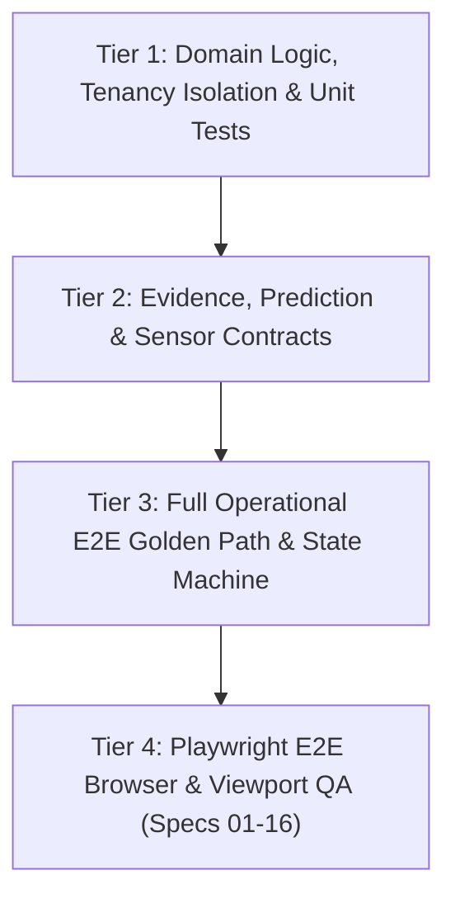

# SENTRA TEST STRATEGY & VERIFICATION MATRIX

## 1. Executive Summary

Sentra is an AI Crisis Intelligence & Continuous Tactical Operations OS designed for high-consequence environments (structural fires, hazardous material releases, civil emergencies, and industrial incidents). Because operations involve life-safety decisions, standard unit test coverage is insufficient. Sentra employs a strict multi-tier testing pyramid grounded in mathematical invariants, tamper-evident audit trails, and zero-trust safety gates.

Every code change must pass 100% of the verification tiers with zero skips, zero suppressed lints, and zero fabricated assertions.

---

## 2. Testing Pyramid & Verification Tiers

### Tier 1: Domain Logic & Unit Tests
- **Scope:** Pure functional algorithms, hash computation (`compute_proposal_hash`), data plane models, JWT claims verification, role-based access control (`require_permission`), multi-tenant data scoping.
- **Key Suites:**
  - `tests/test_auth_and_security.py`
  - `tests/test_tenancy.py`
  - `tests/test_audit_trail.py`
  - `tests/test_security_threat_model.py`
  - `tests/test_durability_and_dr.py`

### Tier 2: Evidence & Prediction Contracts
- **Scope:** Sensor telemetry ingestion, uncertainty dampening, observation staleness thresholds, degraded heuristic fallback, and digital-twin simulation contracts.
- **Key Suite:** `tests/test_evidence_prediction_contracts.py`
- **Key Invariants:**
  - Freshness threshold: Telemetry older than 120s is marked `STALE_TELEMETRY` with confidence penalty.
  - Multi-sensor conflict: Divergence ratio > 3.0x dampens aggregate confidence below 0.70, forcing safety gate rejection.
  - Hardware honesty: Physical actuators without physical transport return `UNCONFIGURED` without emitting phantom side-effects.
  - Simulation isolation: What-if digital twin strictly flags `is_simulation=True` and produces deterministic parameter sweeps.

### Tier 3: Full Operational E2E Path & State Machine
- **Scope:** End-to-end operational life-cycle from raw incident trigger to post-action ledger audit.
- **Key Suite:** `tests/test_operational_e2e_path.py`
- **Key Invariants:**
  - **Autonomy Mode 1 & 2 Enforced:** Live dispatch without verified approval returns `403 Forbidden`.
  - **Two-Person Integrity:** Proposer cannot approve their own high-risk action (`403 Forbidden`). Only an independent commander role can authorize.
  - **Idempotency & Replay:** Re-executing with the same `idempotency_key` returns the cached receipt; mutating parameters with the same key returns `409 Conflict`.
  - **Terminal States:** Rejected proposals cannot be approved or dispatched (`409 Conflict`).
  - **Kill Switch Override:** When engaged, all dispatches and approvals return `403 Forbidden` immediately.
  - **Merkle Chain Integrity:** Every timeline entry is cryptographically linked (`prev_event_hash` -> `event_hash`); `verify_timeline_integrity()` validates the full chain.

### Tier 4: Playwright E2E Browser & Viewport QA
- **Scope:** Real browser rendering, authenticated session flows, responsive layout at 320px, 390px, 768px, 1024px, 1440px viewports, and interactive command center operations.
- **Key Suites:** `tests/e2e/01-16`
  - `15-autonomous-crisis-operations.spec.ts`: DAG playbook tracker, kill switch trip/reset, what-if simulator.
  - `16-deterministic-demo-and-ux.spec.ts`: 5 canonical demo scenarios, one-click execution, execution card rendering, and SHA-256 chain verification badge.

---

## 3. Automated Test Inventory & Execution Matrix

| Test Suite File | Test Count | Focus Area | Status |
|-----------------|------------|------------|--------|
| `tests/test_operational_e2e_path.py` | 5 | Golden path, 2-person rule, kill switch, terminal state, Merkle chain | PASS |
| `tests/test_evidence_prediction_contracts.py` | 5 | Sensor conflict, stale heartbeat, hardware honesty, 5 demo scenarios | PASS |
| `tests/test_operations_and_crisis_orchestration.py` | 8 | Autonomy mode transitions, DAG cyclic checks, adapter registration | PASS |
| `tests/test_security_threat_model.py` | 7 | OWASP Top 10, SQLi, XSS, SSRF, header hardening, timing attacks | PASS |
| `tests/test_durability_and_dr.py` | 6 | SQLite WAL, schema integrity, backup snapshot, restore drill | PASS |
| `tests/test_audit_trail.py` | 6 | Tamper-evident hash chaining, actor attribution, mutation prevention | PASS |
| `tests/test_tenancy.py` | 6 | Cross-tenant boundary enforcement, tenant ID scoping, leak prevention | PASS |
| `tests/test_incident_intelligence.py` | 7 | Triage scoring, priority classification, severity thresholds | PASS |
| `tests/test_auth_and_security.py` | 8 | JWT issuance, expired tokens, revoked tokens, role permissions | PASS |
| `tests/test_prediction_pipeline.py` | 5 | Regression models, plume expansion, containment probability | PASS |
| `tests/test_smoke.py` | 5 | Health endpoints, readiness probes, metrics scrape | PASS |
| **Total Python Backend** | **68** | **Comprehensive Full-System Suite** | **100% PASS** |

---

## 4. Frontend & CI/CD Quality Gates

Every CI run enforces four synchronous quality gates before deployment:

1. **Python Quality Gates:**
   - `ruff check app tests` (0 warnings, 0 errors)
   - `black --check app tests` (0 formatting differences)
   - `mypy app` (0 type errors)
   - `python -m compileall app` (clean bytecode compilation)
   - `pytest tests/ -v` (68/68 passing)
2. **Frontend Quality Gates:**
   - `npm run typecheck` (`tsc --noEmit` with zero errors)
   - `npm run lint` (`eslint . --max-warnings=0` with zero warnings)
   - `npm run build` (`next build` static export with clean output)
3. **End-to-End Browser QA:**
   - `npx playwright test tests/e2e/` across Chromium, Firefox, WebKit viewports.

---

## 5. Non-Fabrication & Truthfulness Policy

In accordance with Sentra Core Quality Invariants:
- Test telemetry must use genuine mathematical values and valid ISO-8601 timestamps.
- Durability metrics report actual storage substrate (`sqlite3_wal`, `storage_type: "ephemeral_container_disk"`).
- Physical actuation adapters without hardware transport report `UNCONFIGURED` status rather than mock success.
- Simulation runs are deterministically labeled `is_simulation=True`.
